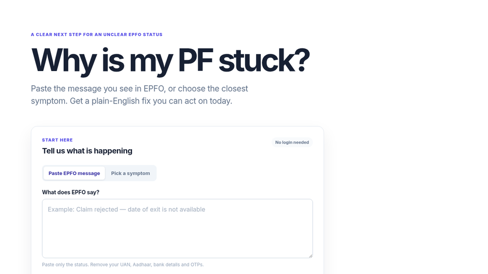

# Why Is My PF Stuck?

<p align="center">
  <a href="https://sandeshl702.github.io/why-is-my-pf-stuck/"></a>
</p>

<p align="center">
  <a href="https://sandeshl702.github.io/why-is-my-pf-stuck/"><strong>Live → sandeshl702.github.io/why-is-my-pf-stuck</strong></a>
</p>

<p align="center">
  
  
  
  
</p>

**Why is my PF stuck?** helps anyone in India whose EPFO claim was rejected or whose PF status makes no sense.

Paste the rejection line (or pick a symptom). Get a plain-English diagnosis, a fix checklist, a ready HR email, and an **EPFiGMS grievance** draft.

## Who it is for

- Claim rejected for date of exit, name/DOB mismatch, KYC, bank/IFSC, employer issues
- Wrong form / EPS / transfer problems
- You need the next concrete step — not portal jargon

## Features

| Input | Output |
|---|---|
| EPFO rejection text | Plain-English diagnosis |
| Or pick a symptom | Fix checklist |
| Same | Ready-to-send HR email |
| Same | EPFiGMS grievance draft |

Runs entirely in the browser. **No login. No UAN. No uploads. No analytics.**

## Live demo

**[https://sandeshl702.github.io/why-is-my-pf-stuck/](https://sandeshl702.github.io/why-is-my-pf-stuck/)**

## Stack

Next.js · TypeScript · Tailwind CSS · client-side rules (zero backend)

## SEO keywords

why is my PF stuck · EPFO claim rejected · provident fund India · EPFiGMS grievance · PF date of exit · HR email for PF · EPFO rejection fix

## Run locally

```bash
git clone https://github.com/SandeshL702/why-is-my-pf-stuck.git
cd why-is-my-pf-stuck
npm i
npm run dev
```

Open [http://localhost:3000](http://localhost:3000).

## License

MIT · [Sandesh Lanjewar](https://github.com/SandeshL702)

Independent utility — not affiliated with EPFO. Not legal or financial advice.
